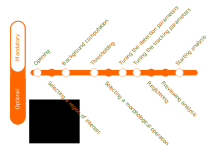
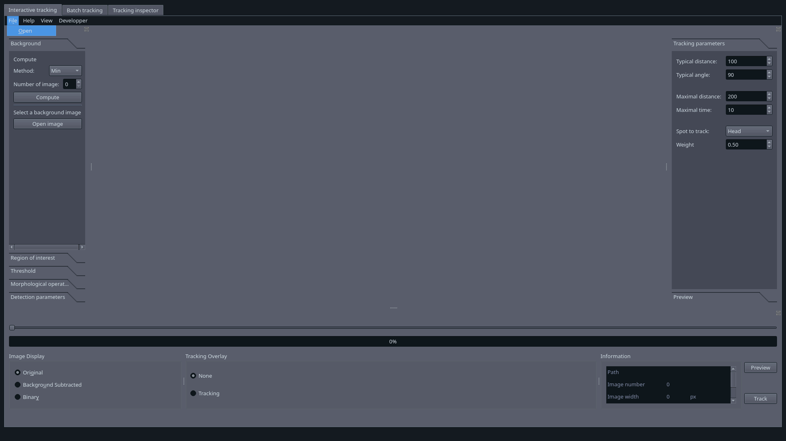
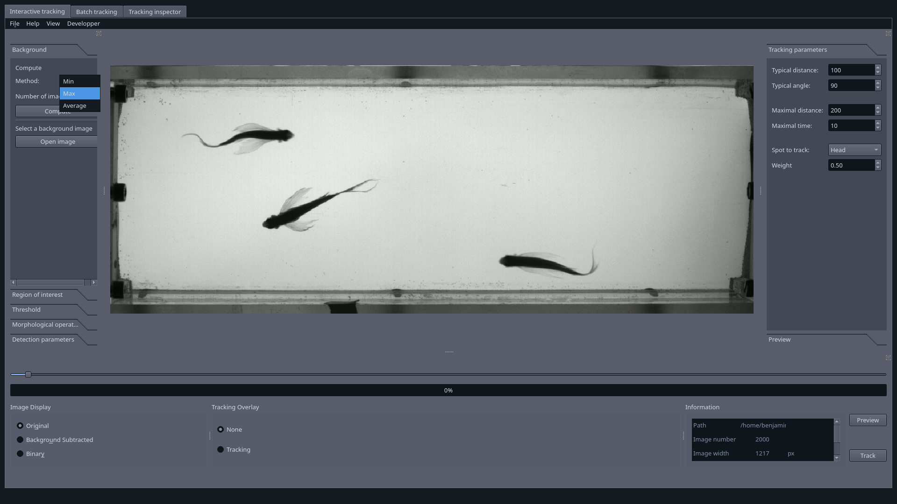
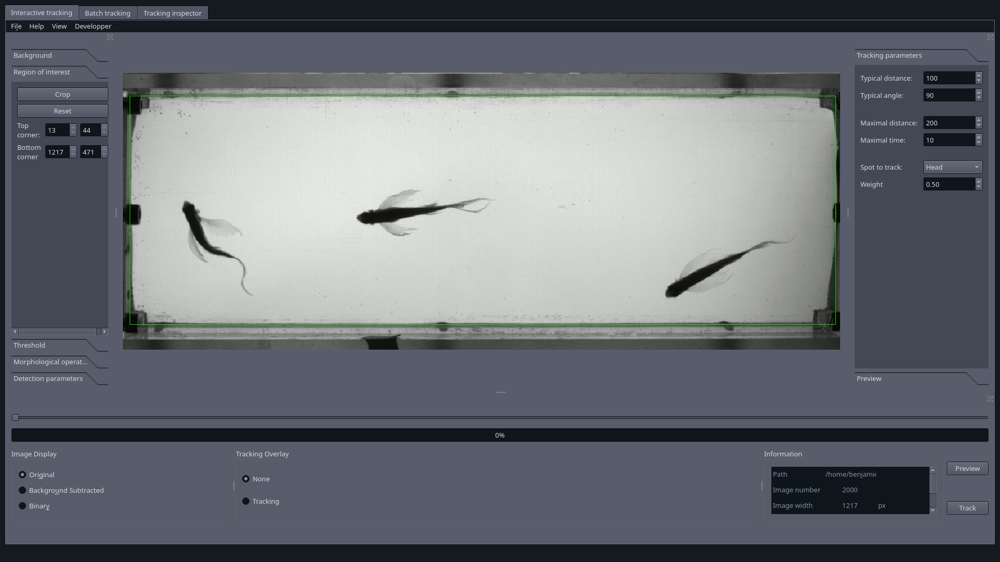
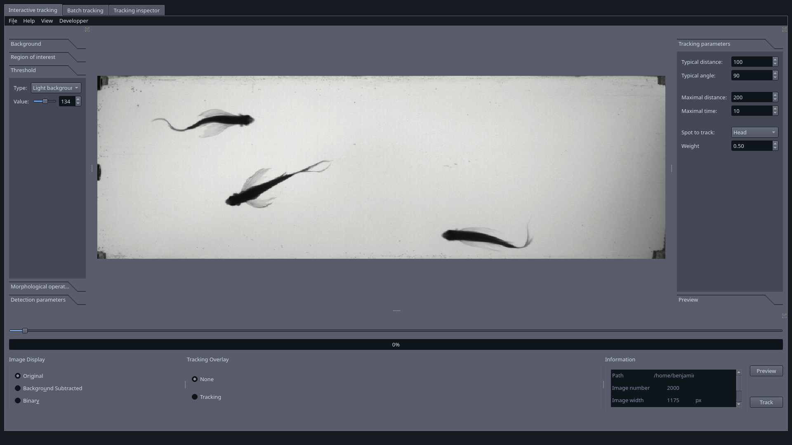
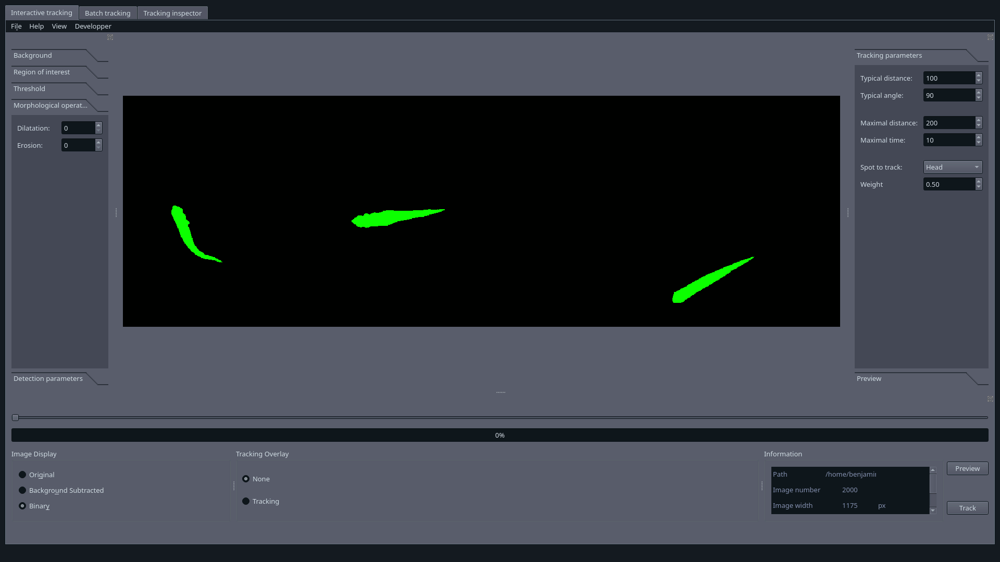
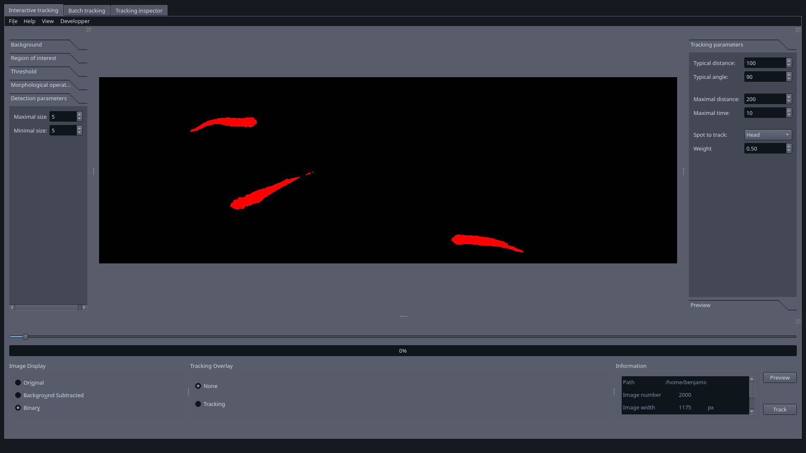

The Interactive panel provides a means to perform a tracking analysis, and review the tracking in an interactive environment.
Several steps have to be performed in the right order (some are mandatory, some are optional) to perform a successful tracking analysis.

## Open an image sequence
The first step of a tracking analysis is to open an image sequence. In the menu bar, click on File then Open and select the folder that contains the image sequence to analyze.

## Compute the background
The background can be computed or imported. To compute the background, select a method and a number of images. Images are selected in the image sequence at regular intervals and three methods of computation by z-projection are available: 
* Min: each pixel of the background image is the pixel with the minimal value across the selected images from the image sequence. Useful when the objects are light on a dark background.
* Max: each pixel of the background image is the pixel with the maximal value across the selected images from the image sequence. Useful when the objects are dark on light background.
* Average: each pixel of the background image is the average of the pixels across the selected images from the image sequence.
The images can be registered before the z-projection, three methods of registration are available.

## Select a region of interest (optional)
To select a region of interest, draw on the display a rectangle with the mouse and click on the Crop button. Cancel the crop by clicking on the reset button.

## Compute the binary image
To compute the binary image from the background image and the image sequence, select the threshold value and see the result on the display. The background type is automatically selected after the background computation but can be modified: select Dark Background if the objects are light on a dark background, and Light background if the objects are dark on a light background.

## Apply morphological operations (optional)
It is possible to apply a morphological operation on the binary image. Select a morphological operation, kernel size, and geometry. See the result on the display. For more information about the different operations see https://docs.opencv.org/trunk/d9/d61/tutorial_py_morphological_ops.html.

## Tune the detection parameters
Objects are detected by their size. Select the maximum and minimum size of the detected objects. The detected objects will be colored in green in the display and rejected object will be displayed in red.

## Tune the tracking parameters
Several parameters can be modified to ensure a good tracking analysis:
* Normalization distance (legacy Maximal lenght/ Typical lenght): typical distance traveled between two consecutive images.
* Normalization angle (legacy Maximal angle/Typical lenght): maximal reorientation possible between two consecutive images.
* Maximal distance: if an object traveled more than this distance between two consecutive images, it will be considered as a new object.
* Maximal time: number of images an object is allowed to disappear. If an object reappears after this time, it will be considered as a new object.
* Spot to track: part of the object features used to do the tracking. Select the part that reflects the better the direction of the object. Legacy parameter, head correspond to the smaller mid-part of the object, tail ellipse the wider mid-part og the object and body is the full object.
* Weight: closer to one the tracking will be more sensitive to the change in position of the object. Closer to zero it will be more sensitive to the change in direction of the object.

## Registration
The image registration is the process to correct small displacements and rotation of the camera that can occur during the movie. Fast Track provides several methods for registering the movie: 
* By phase correlation
* ECC image alignment
* Features based

Image registration is very computationally intensive and can drastically decrease the speed of the program.

## Preview the tracking
The tracking can be previewed on a sub-sequence of image. It can be useful to tune parameters if the tracking is slow.

## Display options
Several display options are available and unlocked at each step of the analysis.
* Original: original image sequence
* Background subtracted: image sequence minus the background image.
* Binary: binary image sequence with detection overlays.
* Tracking: tracking data overlay. 

## Layout options
Several layout options are available in the layout menu in the top bar. You can also build your layout by dragging the option docks in the window.
